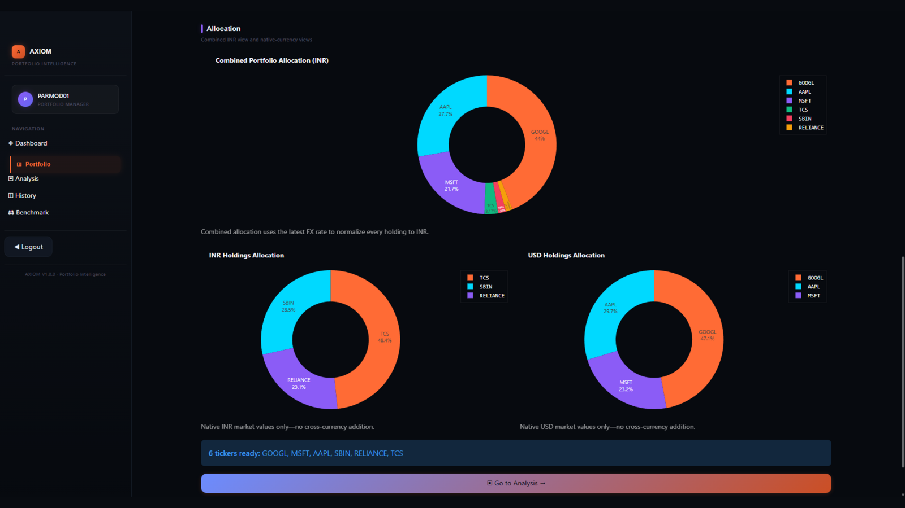
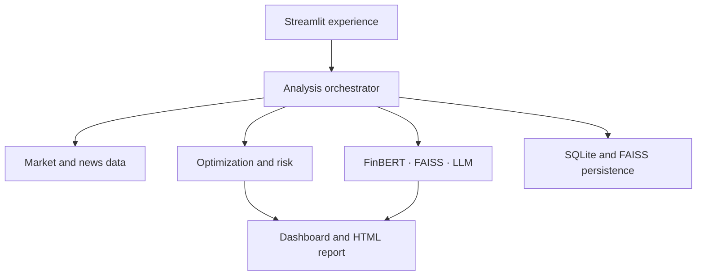
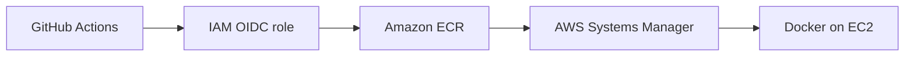

# AXIOM Portfolio Intelligence

> An end-to-end portfolio research platform combining constrained optimization, risk analytics, financial NLP, semantic retrieval, and evidence-grounded AI commentary.

<p align="center">
  <a href="https://parmodk2310.vercel.app/projects/portfolio"><strong>Case Study</strong></a> ·
  <a href="https://github.com/Parmodk2310/AI-Powered-Portfolio-Optimizer"><strong>Source</strong></a>
</p>

<p align="center">
  <a href="https://github.com/Parmodk2310/AI-Powered-Portfolio-Optimizer/actions/workflows/deploy-production.yml"></a>
  <a href="https://github.com/Parmodk2310/AI-Powered-Portfolio-Optimizer/actions/workflows/security.yml"></a>
  
  
  
  
  
</p>


## Why AXIOM

Portfolio tools often separate allocation, risk, news, and AI commentary. AXIOM connects them in one reproducible workflow: it retrieves market data, estimates portfolio risk, creates constrained allocations, evaluates company news with FinBERT, retrieves relevant evidence with FAISS, and generates a portfolio report through an LLM.

This repository demonstrates production-oriented ML engineering beyond model experimentation: modular pipelines, persistent state, failure handling, walk-forward evaluation, automated quality gates, container hardening, and infrastructure as code.

## What it delivers

- Portfolio creation, holdings management, and analysis history
- Adaptive Modern Portfolio Theory with allocation constraints
- Equal-weight and efficient-frontier comparisons
- Volatility, Value at Risk, maximum drawdown, and correlation analysis
- Ticker-aware financial-news retrieval and FinBERT sentiment scoring
- FAISS retrieval with LangChain/Groq commentary grounded in available context
- Interactive Plotly dashboards and downloadable HTML reports
- Graceful degradation when news or LLM providers are unavailable
- SQLite and FAISS persistence through a Docker volume
- Dockerized deployment on AWS EC2 provisioned by CloudFormation

## Product walkthrough

### Portfolio construction

Create a multi-market portfolio and review currency-normalized allocation across US and Indian equities.



### AI-powered optimization

Compare constrained optimized targets against an equal-weight baseline and review the resulting portfolio KPIs.


### Risk intelligence

Inspect Value at Risk, maximum drawdown, concentration, correlation, volatility, and risk-adjusted performance.


### Evidence-grounded AI research

Review ticker-level sentiment, supporting financial-news evidence, risk scenarios, and quantitative next steps.


### Benchmark validation

Compare the final target portfolio with equal-weight allocation and the S&P 500 benchmark.


> Historical analysis is illustrative and does not guarantee future performance.

## Architecture



The application keeps quantitative calculations separate from probabilistic AI output. Optimized weights come from the portfolio engine; the LLM explains the result using retrieved context rather than determining the allocation itself.

### Analysis flow

1. Validate holdings and download adjusted historical prices.
2. Calculate returns, covariance, volatility, drawdown, VaR, and correlations.
3. Generate allocations under weight and concentration constraints.
4. Fetch company news and score relevant headlines with FinBERT.
5. Retrieve supporting context from FAISS.
6. Generate evidence-grounded commentary and a portable HTML report.
7. Persist the run for later review.

## Engineering decisions

| Concern | Design choice | Reason |
|---|---|---|
| Explainability | Quantitative results remain separate from LLM commentary | Prevents generated text from silently changing portfolio weights |
| Reliability | External AI/news failures degrade gracefully | Core portfolio analytics remain usable |
| Reproducibility | Walk-forward evaluation with costs and turnover | Avoids presenting an in-sample optimizer result as performance evidence |
| Persistence | Named Docker volume mounted at `/data` | Survives container recreation on the current single-host deployment |
| Runtime security | Streamlit XSRF/CORS protections enabled; containers run as UID/GID 10001 | Reduces browser and container privilege risk |
| Delivery security | GitHub Actions use OIDC; third-party actions are commit-SHA pinned | Avoids long-lived AWS keys and mutable action tags |
| Release images | ECR images use immutable Git commit SHA tags | Makes deployments and rollbacks traceable |
| Remote delivery | AWS Systems Manager runs deployment on EC2 | Removes SSH credentials from the CI/CD path |

## Verified evaluation

A price-only walk-forward backtest covers **4 January 2021–31 December 2025** using AAPL, MSFT, GOOGL, AMZN, and META. It uses a 252-trading-day lookback, monthly rebalancing, 2–35% asset bounds, a 5% annual risk-free rate, and 15 bps transaction costs.

| Metric | Quantitative strategy | Equal weight | S&P 500 |
|---|---:|---:|---:|
| Net CAGR | 16.83% | 20.59% | 13.12% |
| Annualized volatility | 26.51% | 26.76% | 16.96% |
| Sharpe ratio | 0.536 | 0.653 | 0.526 |
| Maximum drawdown | -39.63% | -46.55% | -25.43% |
| Annual one-way turnover | 167.46% | 25.03% | N/A |
| CAGR cost drag | 0.59% | 0.09% | 0.00% |

Equal weighting led on return and Sharpe ratio in this concentrated universe. The quantitative strategy reduced drawdown versus equal weight, but higher turnover created meaningful cost drag. Optimization complexity did not automatically produce superior out-of-sample performance.

The combined price-and-sentiment strategy is intentionally **not** reported as historically validated because the repository does not yet include a point-in-time news dataset. Using current news to simulate past decisions would introduce look-ahead bias. See [`backtesting.md`](backtesting.md) for the complete methodology.

## Technology

| Layer | Tools |
|---|---|
| Application | Python, Streamlit, Plotly, pandas, NumPy |
| Quantitative | SciPy/scikit-learn, MPT, risk and performance analytics |
| AI/NLP | FinBERT, Hugging Face Transformers, FAISS, LangChain, Groq |
| Data | Yahoo Finance, NewsAPI |
| Persistence | SQLite, FAISS index |
| Delivery | Docker, Docker Compose, AWS EC2, CloudFormation, GitHub Actions |

## Run locally

### Prerequisites

- Python 3.10+
- Git
- NewsAPI and Groq keys for the corresponding optional features

```bash
git clone https://github.com/Parmodk2310/AI-Powered-Portfolio-Optimizer.git
cd AI-Powered-Portfolio-Optimizer

python -m venv .venv
source .venv/bin/activate          # Windows: .venv\Scripts\Activate.ps1
python -m pip install -r requirements-frontend.txt
cp backend/.env.example .env      # Windows: Copy-Item backend\.env.example .env
streamlit run frontend/app.py
```

Open `http://localhost:8501`.

Minimum `.env` configuration:

```env
NEWS_API_KEY=your_newsapi_key
GROQ_API_KEY=your_groq_key
GROQ_MODEL=openai/gpt-oss-120b
DB_DIR=/data
FAISS_INDEX_PATH=/data/faiss_index
```

Never commit `.env`, AWS credentials, API keys, databases containing user data, or private keys.

## Run with Docker

```bash
docker compose up --build -d
docker compose ps
curl --fail http://localhost:8501/_stcore/health
```

The runtime image uses a dedicated non-root user. Existing persistent volumes created by older root-running images may need their `/data` ownership migrated to UID/GID `10001`; the production deployment script performs that migration before recreation.

## Quality gate

The Makefile is the local and CI quality contract:

```bash
make install-dev
make check
```

`make check` runs Python compilation, Black format verification, Ruff linting, mypy type checking, and the complete pytest suite. Pull requests must pass the same gate before merge.

Security CI separately runs secret scanning, reports high/critical dependency and container findings, and blocks critical vulnerabilities. See [`SECURITY.md`](SECURITY.md) and [`CONTRIBUTING.md`](CONTRIBUTING.md).

## Deployment and infrastructure



The demo infrastructure is an Amazon Linux 2023 EC2 instance provisioned through [`deploy/aws/ec2-stack.yaml`](deploy/aws/ec2-stack.yaml). Docker Compose runs Streamlit while a named volume persists SQLite and FAISS data under `/data`.

Pull requests run quality and security gates. A push to `main` receives temporary AWS credentials through IAM OIDC, builds an image tagged with the exact Git commit SHA, stores it in ECR, and deploys it through Systems Manager. The instance checks `/_stcore/health`; a failed deployment restores the previously running image and keeps the workflow failed for visibility.

The CloudFormation security group restricts port `8501` to `AllowedCidr`. AXIOM therefore does **not** advertise the current raw EC2 IP as a public live demo. A public recruiter-facing endpoint should be added only after a stable domain, HTTPS termination, and appropriate ingress controls are in place.

Operational commands and AWS details live in [`deploy/aws/README.md`](deploy/aws/README.md).

## Release status

No GitHub Release is currently published. The repository keeps a clearly labeled [release-note template](docs/release-notes-template.md); completed release evidence should be created from that template only after every required gate has passed.

See [`docs/AXIOM_PRODUCTION_RELEASE_GUIDE.md`](docs/AXIOM_PRODUCTION_RELEASE_GUIDE.md) for the release and rollback runbook.

## Current limitations

- Historical estimates do not predict future performance.
- FinBERT can misclassify ambiguous or context-poor headlines.
- Retrieved context reduces, but cannot eliminate, LLM hallucination.
- The current single-EC2/SQLite design is not highly available or horizontally scalable.
- The current demo is operator-restricted HTTP on port 8501; it is not a stable public HTTPS endpoint.
- Managed secrets, centralized monitoring/alerting, and database-aware rollback remain production hardening work.
- Point-in-time news data is not yet available, so historical sentiment performance is intentionally not claimed.

## Roadmap

- [x] Leakage-aware walk-forward backtesting with turnover and costs
- [x] Containerized EC2 deployment with persistent application data
- [x] GitHub Actions deployment using IAM OIDC and immutable ECR tags
- [x] Health-gated application rollback to the previous container image
- [x] Full CI quality gate matching `make check`
- [x] Commit-SHA-pinned third-party GitHub Actions
- [x] Secret, dependency, and container security scans
- [x] Streamlit XSRF protection and non-root container runtime
- [ ] Point-in-time news dataset and sentiment backtesting
- [ ] Retrieval relevance and groundedness evaluation
- [ ] HTTPS, stable domain, managed secrets, CloudWatch metrics, and alarms
- [ ] PostgreSQL migrations and managed backups for multi-user scale

## Repository map

```text
frontend/        Streamlit application and pages
backend/app/     Optional FastAPI service
src/data/        Market data, news, and retrieval pipelines
src/models/      Sentiment and AI components
src/optimization Portfolio construction and risk logic
src/database/    Persistence layer
tests/           Automated test suite
deploy/aws/      CloudFormation and deployment documentation
docs/            Architecture, setup, release, and API documentation
```

## Responsible use

AXIOM is an educational and research project, not financial advice. Outputs may be incomplete or incorrect and should not be used as the sole basis for investment decisions.

## Contributing and security

Development workflow: [`CONTRIBUTING.md`](CONTRIBUTING.md)  
Private vulnerability reporting: [`SECURITY.md`](SECURITY.md)

## Author

**Parmod K.** — Data Science, Machine Learning, and Generative AI  
[Portfolio](https://parmodk2310.vercel.app/) · [GitHub](https://github.com/Parmodk2310)

## License

Released under the [`MIT License`](LICENSE).
