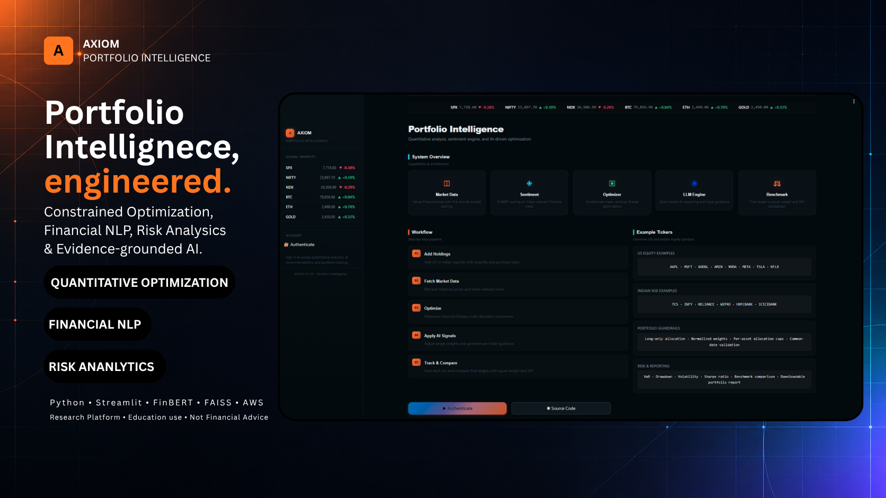
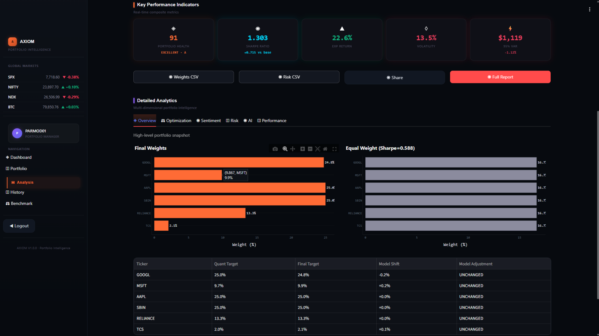
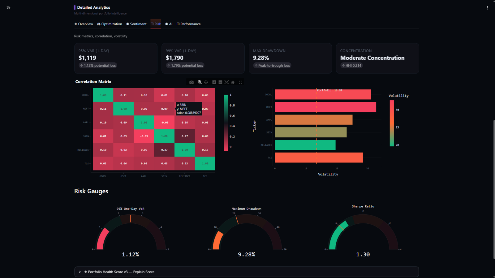
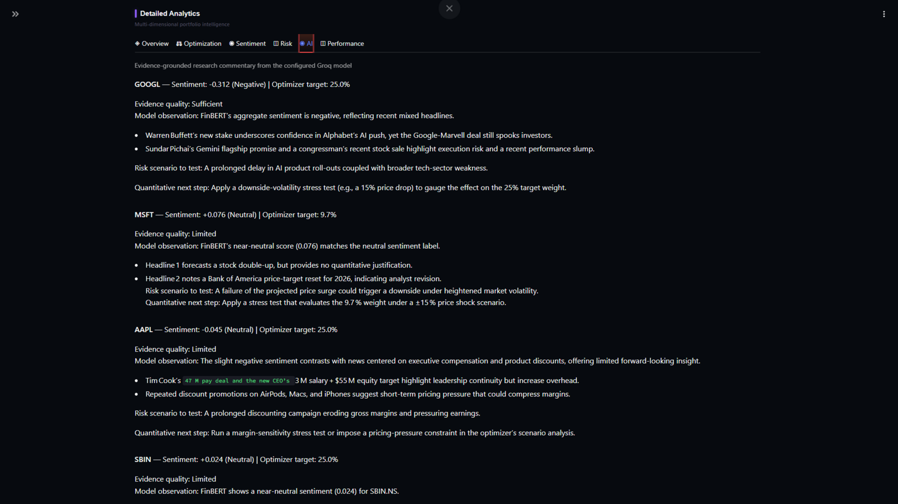
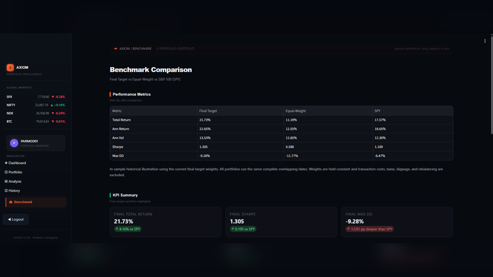
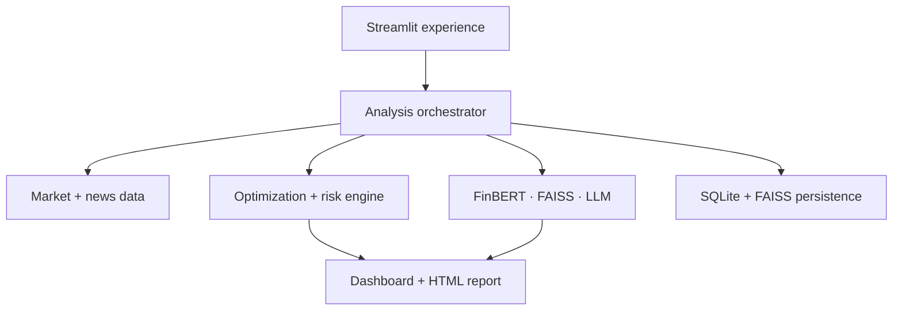
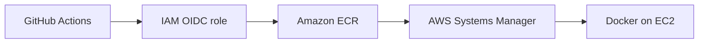

# AXIOM Portfolio Intelligence

> A production-oriented portfolio research platform combining constrained optimization, risk analytics, financial NLP, semantic retrieval, and evidence-grounded AI commentary.

<p align="center">
  <a href="https://parmodk2310.vercel.app/projects/portfolio-optimizer"><strong>Case Study</strong></a> ·
  <a href="https://github.com/Parmodk2310/AI-Powered-Portfolio-Optimizer/releases"><strong>Releases</strong></a> ·
  <a href="docs/README.md"><strong>Docs</strong></a> ·
  <a href="docs/AXIOM_PRODUCTION_RELEASE_GUIDE.md"><strong>Release Guide</strong></a>
</p>

<p align="center">
  <a href="https://github.com/Parmodk2310/AI-Powered-Portfolio-Optimizer/actions/workflows/deploy-production.yml"></a>
  <a href="https://github.com/Parmodk2310/AI-Powered-Portfolio-Optimizer/actions/workflows/security.yml"></a>
  <a href="https://github.com/Parmodk2310/AI-Powered-Portfolio-Optimizer/releases"></a>
  
  
  
  
</p>



## Project snapshot

| Area | Evidence |
|---|---|
| Portfolio engine | Constrained MPT, efficient frontier, equal-weight baseline, turnover-aware walk-forward evaluation |
| Risk analytics | Volatility, VaR, drawdown, concentration, correlation, risk-adjusted performance |
| AI/NLP | FinBERT sentiment, FAISS retrieval, LangChain/Groq commentary |
| Reliability | Graceful degradation when news or LLM providers are unavailable |
| Quality | 84 automated tests plus Black, Ruff, mypy, and compile checks |
| Security | 0 CRITICAL findings; runtime HIGH findings reduced from 15 to 2 with residual risk documented |
| Delivery | GitHub Actions OIDC → immutable ECR image → AWS Systems Manager → EC2 |
| Runtime | Dockerized Streamlit service running as non-root UID/GID 10001 |

The project snapshot above reflects the currently verified `main` baseline; exact test and security counts are point-in-time evidence and are also recorded in the release/security documentation.

AXIOM is designed as an engineering portfolio project rather than a claim that AI automatically improves investment performance. Quantitative allocation remains deterministic and separate from generated commentary, and the evaluation reports cases where simpler baselines outperform the optimizer.

## Why AXIOM

Many portfolio demos stop at an optimizer notebook. AXIOM connects the full workflow:

1. ingest and validate holdings;
2. retrieve and normalize historical market data;
3. calculate portfolio risk and constrained allocations;
4. evaluate relevant company news with FinBERT;
5. retrieve supporting context with FAISS;
6. generate evidence-grounded commentary without allowing the LLM to alter portfolio weights;
7. produce an interactive dashboard and downloadable HTML report;
8. persist analysis state for later review;
9. package and deploy the application through a tested CI/CD path.

The result is a compact example of quantitative engineering, ML/NLP integration, application design, testing, security hardening, and cloud delivery in one repository.

## Product walkthrough

### Portfolio construction and optimization

Create a multi-market portfolio, inspect normalized allocation, and compare constrained optimized targets with an equal-weight baseline.



### Risk intelligence

Review volatility, Value at Risk, maximum drawdown, concentration, correlation, and risk-adjusted performance.



### Evidence-grounded AI research

Inspect ticker-level sentiment, supporting news evidence, risk scenarios, and AI commentary grounded in retrieved context.



### Benchmark validation

Compare the final target portfolio with equal-weight allocation and the S&P 500 benchmark.



> Historical analysis is illustrative and does not guarantee future performance.

## Architecture



The important design boundary is between quantitative decisions and probabilistic text generation. Portfolio weights come from the optimization engine. The LLM explains the result using retrieved context; it does not silently rewrite the allocation.

## Engineering decisions

| Concern | Design choice | Why |
|---|---|---|
| Explainability | Keep optimizer outputs separate from LLM commentary | Generated text cannot silently change quantitative targets |
| Reliability | Degrade gracefully when external AI/news services fail | Core portfolio analytics remain available |
| Evaluation | Walk-forward testing with turnover and transaction costs | Reduces the risk of presenting an in-sample result as evidence |
| Persistence | Named Docker volume mounted at `/data` | Preserves SQLite and FAISS state across container recreation |
| Runtime security | XSRF/CORS protections and non-root container user | Reduces browser and container privilege risk |
| CI/CD identity | GitHub OIDC with temporary AWS credentials | Avoids long-lived AWS access keys in GitHub |
| Release images | Immutable ECR tags based on Git commit SHA | Makes deployments and rollback targets traceable |
| Remote delivery | AWS Systems Manager instead of SSH-based CI deployment | Removes SSH credentials from the deployment path |

## Verified quantitative evaluation

A price-only walk-forward backtest covers **4 January 2021–31 December 2025** using AAPL, MSFT, GOOGL, AMZN, and META. It uses a 252-trading-day lookback, monthly rebalancing, 2–35% asset bounds, a 5% annual risk-free rate, and 15 bps transaction costs.

| Metric | Quantitative strategy | Equal weight | S&P 500 |
|---|---:|---:|---:|
| Net CAGR | 16.83% | 20.59% | 13.12% |
| Annualized volatility | 26.51% | 26.76% | 16.96% |
| Sharpe ratio | 0.536 | 0.653 | 0.526 |
| Maximum drawdown | -39.63% | -46.55% | -25.43% |
| Annual one-way turnover | 167.46% | 25.03% | N/A |
| CAGR cost drag | 0.59% | 0.09% | 0.00% |

Equal weighting led on return and Sharpe ratio in this concentrated universe. The quantitative strategy reduced drawdown versus equal weight, but higher turnover created meaningful cost drag. The repository therefore does not claim that optimization complexity automatically produces superior out-of-sample performance.

The combined price-and-sentiment strategy is intentionally **not** reported as historically validated because the repository does not include a point-in-time news dataset. Using current news to simulate past decisions would introduce look-ahead bias. See [`backtesting.md`](backtesting.md) for the methodology.

## Security and quality evidence

The repository uses separate scans for the broad development snapshot and the deployed Streamlit image.

| Scan scope | Before hardening | Current documented state |
|---|---:|---:|
| Repository dependencies | 22 HIGH / 0 CRITICAL | 16 HIGH / 0 CRITICAL |
| Runtime container | 15 HIGH / 0 CRITICAL | 2 HIGH / 0 CRITICAL |

The remaining HIGH findings are documented rather than hidden or excluded. See [`docs/security/dependency-risk-register.md`](docs/security/dependency-risk-register.md).

The quality contract runs:

```text
compileall
Black --check
Ruff
mypy
pytest
```

The current validated suite contains **84 tests**, including authentication/security behavior, portfolio calculations, backtesting, sentiment classification, Transformers compatibility, RAG fallback behavior, news relevance, rebalancing, and safe report generation.

## Technology

| Layer | Tools |
|---|---|
| Application | Python, Streamlit, Plotly, pandas, NumPy |
| Quantitative | SciPy, scikit-learn, constrained MPT, risk/performance analytics |
| AI/NLP | FinBERT, Transformers 5.x, Sentence Transformers, FAISS, LangChain, Groq |
| Data | Yahoo Finance, financial-news providers |
| Persistence | SQLite, FAISS index |
| Delivery | Docker, Docker Compose, AWS EC2, ECR, Systems Manager, CloudFormation, GitHub Actions |

## Run locally

### Prerequisites

- Python 3.10+
- Git
- NewsAPI and Groq keys for optional external-provider features

```bash
git clone https://github.com/Parmodk2310/AI-Powered-Portfolio-Optimizer.git
cd AI-Powered-Portfolio-Optimizer

python -m venv .venv
source .venv/bin/activate          # Windows: .venv\Scripts\Activate.ps1
python -m pip install -r requirements-frontend.txt
cp backend/.env.example .env      # Windows: Copy-Item backend\.env.example .env
streamlit run frontend/app.py
```

Open `http://localhost:8501`.

Minimum `.env` configuration:

```env
NEWS_API_KEY=your_newsapi_key
GROQ_API_KEY=your_groq_key
GROQ_MODEL=openai/gpt-oss-120b
DB_DIR=/data
FAISS_INDEX_PATH=/data/faiss_index
```

Never commit `.env`, AWS credentials, API keys, private keys, databases containing user data, or generated reports containing private portfolio information.

## Run with Docker

```bash
docker compose up --build -d
docker compose ps
curl --fail http://localhost:8501/_stcore/health
```

The runtime image uses a dedicated non-root user. Existing volumes created by older root-running images may need `/data` ownership migrated to UID/GID `10001`; the production deployment script performs this migration before container recreation.

## CI/CD and deployment



Pull requests run quality and security gates. A push to `main` receives temporary AWS credentials through IAM OIDC, builds or reuses an immutable image tagged with the exact Git commit SHA, stores it in ECR, and deploys through Systems Manager.

The EC2 deployment polls the Streamlit health endpoint and restores the previously running image if the candidate fails health validation.

AWS implementation details are documented in [`deploy/aws/README.md`](deploy/aws/README.md).

## Release

The first stable release line is **v1.0.0**.

- [v1.0.0 release notes](docs/release-notes-v1.0.0.md)
- [Production release and rollback guide](docs/AXIOM_PRODUCTION_RELEASE_GUIDE.md)
- [Dependency residual-risk register](docs/security/dependency-risk-register.md)
- [GitHub Releases](https://github.com/Parmodk2310/AI-Powered-Portfolio-Optimizer/releases)

Release tags must point to a verified commit on protected `main`. Do not move a published tag; use a new semantic version for subsequent releases.

## Current limitations

- Historical estimates do not predict future performance.
- FinBERT can misclassify ambiguous or context-poor headlines.
- Retrieved context reduces, but cannot eliminate, LLM hallucination.
- The current single-EC2/SQLite design is not highly available or horizontally scalable.
- The current operator-restricted HTTP demo is not a stable public HTTPS endpoint.
- Point-in-time news data is not yet available, so historical sentiment performance is intentionally not claimed.
- Managed secrets, centralized monitoring/alerting, and database-aware rollback remain further production-hardening work.
- Residual HIGH dependency findings remain documented and monitored; the project does not describe the current scan as vulnerability-free.

## Repository map

```text
frontend/        Streamlit application and pages
backend/app/     Optional FastAPI service
src/data/        Market data, news, and retrieval pipelines
src/models/      Sentiment and AI components
src/optimization Portfolio construction and risk logic
src/database/    Persistence layer
tests/           Automated test suite
deploy/aws/      CloudFormation and deployment documentation
docs/            Architecture, security, setup, release, and API documentation
```

## Responsible use

AXIOM is an educational and research project, not financial advice. Outputs may be incomplete or incorrect and should not be used as the sole basis for investment decisions.

## Contributing and security

Development workflow: [`CONTRIBUTING.md`](CONTRIBUTING.md)  
Private vulnerability reporting: [`SECURITY.md`](SECURITY.md)

## Author

**Parmod K.** — Data Science, Machine Learning, and Generative AI  
[Portfolio](https://parmodk2310.vercel.app/) · [GitHub](https://github.com/Parmodk2310)

## License

Released under the [`MIT License`](LICENSE).
