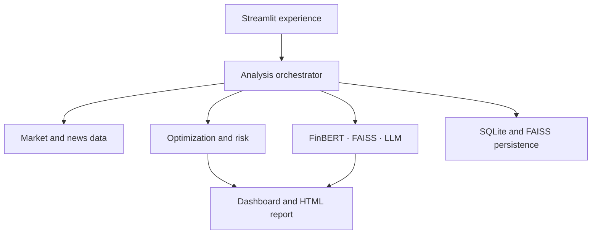
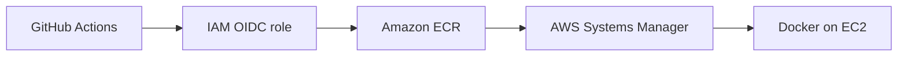

# AXIOM Portfolio Intelligence

> An end-to-end portfolio research platform combining constrained optimization, risk analytics, financial NLP, semantic retrieval, and evidence-grounded AI commentary.

<p align="center">
  <a href="http://15.252.103.217:8501"><strong>Live Demo</strong></a> ·
  <a href="https://parmodk2310.vercel.app/projects/portfolio"><strong>Case Study</strong></a> ·
  <a href="https://github.com/Parmodk2310/AI-Powered-Portfolio-Optimizer"><strong>Source</strong></a>
</p>

<p align="center">
  
  
  
  
  
  
  
</p>

<!-- Add docs/demo/axiom-v1-demo.gif here after recording and sanitizing it. -->

## Why AXIOM

Portfolio tools often separate allocation, risk, news, and AI commentary. AXIOM connects them in one reproducible workflow: it retrieves market data, estimates portfolio risk, creates constrained allocations, evaluates company news with FinBERT, retrieves relevant evidence with FAISS, and generates a portfolio report through an LLM.

This repository demonstrates production-oriented ML engineering—not only model experimentation—including modular pipelines, persistent application state, failure handling, testing, containerization, and infrastructure as code.

## What it delivers

- Portfolio creation, holdings management, and analysis history
- Adaptive Modern Portfolio Theory with allocation constraints
- Equal-weight and efficient-frontier comparisons
- Volatility, Value at Risk, maximum drawdown, and correlation analysis
- Ticker-aware financial-news retrieval and FinBERT sentiment scoring
- FAISS retrieval with LangChain/Groq commentary grounded in available context
- Interactive Plotly dashboards and downloadable HTML reports
- Graceful degradation when news or LLM providers are unavailable
- SQLite and FAISS persistence through a Docker volume
- Dockerized deployment on AWS EC2 provisioned by CloudFormation

## Architecture



The application keeps quantitative calculations separate from probabilistic AI output. Optimized weights come from the portfolio engine; the LLM explains the result using retrieved context rather than determining the allocation itself.

### Analysis flow

1. Validate holdings and download adjusted historical prices.
2. Calculate returns, covariance, volatility, drawdown, VaR, and correlations.
3. Generate allocations under weight and concentration constraints.
4. Fetch company news and score relevant headlines with FinBERT.
5. Retrieve supporting context from FAISS.
6. Generate evidence-grounded commentary and a portable HTML report.
7. Persist the run for later review.

## Engineering decisions

| Concern | Design choice | Reason |
|---|---|---|
| Explainability | Quantitative results remain separate from LLM commentary | Prevents generated text from silently changing portfolio weights |
| Reliability | External AI/news failures degrade gracefully | Core portfolio analytics remain usable |
| Reproducibility | Walk-forward evaluation with costs and turnover | Avoids presenting an in-sample optimizer result as performance evidence |
| Persistence | Named Docker volume mounted at `/data` | Survives container recreation on the current single-host deployment |
| Security | Secrets are injected at runtime and excluded from Git | Reduces accidental credential exposure |
| Deployment | CloudFormation + Docker Compose on EC2 | Makes the demo environment repeatable and inspectable |
| CI/CD identity | GitHub Actions exchanges an OIDC token for temporary AWS credentials | Avoids long-lived AWS access keys in GitHub |
| Release images | ECR images use immutable Git commit SHA tags | Makes each deployment traceable and rollback-safe |
| Remote delivery | AWS Systems Manager runs the deployment on EC2 | Removes SSH credentials from the CI/CD path |

## Verified evaluation

A price-only walk-forward backtest covers **4 January 2021–31 December 2025** using AAPL, MSFT, GOOGL, AMZN, and META. It uses a 252-trading-day lookback, monthly rebalancing, 2–35% asset bounds, a 5% annual risk-free rate, and 15 bps transaction costs.

| Metric | Quantitative strategy | Equal weight | S&P 500 |
|---|---:|---:|---:|
| Net CAGR | 16.83% | 20.59% | 13.12% |
| Annualized volatility | 26.51% | 26.76% | 16.96% |
| Sharpe ratio | 0.536 | 0.653 | 0.526 |
| Maximum drawdown | -39.63% | -46.55% | -25.43% |
| Annual one-way turnover | 167.46% | 25.03% | N/A |
| CAGR cost drag | 0.59% | 0.09% | 0.00% |

Equal weighting led on return and Sharpe ratio in this concentrated universe. The quantitative strategy reduced drawdown versus equal weight, but higher turnover created meaningful cost drag. This is an important result: optimization complexity did not automatically produce superior out-of-sample performance.

The combined price-and-sentiment strategy is intentionally **not** reported as historically validated because the repository does not yet include a point-in-time news dataset. Using current news to simulate past decisions would introduce look-ahead bias. See [`backtesting.md`](backtesting.md) for the complete methodology.

## Technology

| Layer | Tools |
|---|---|
| Application | Python, Streamlit, Plotly, pandas, NumPy |
| Quantitative | SciPy/scikit-learn, MPT, risk and performance analytics |
| AI/NLP | FinBERT, Hugging Face Transformers, FAISS, LangChain, Groq |
| Data | Yahoo Finance, NewsAPI |
| Persistence | SQLite, FAISS index |
| Delivery | Docker, Docker Compose, AWS EC2, CloudFormation |

## Run locally

### Prerequisites

- Python 3.10+
- Git
- NewsAPI and Groq keys for the corresponding optional features

```bash
git clone https://github.com/Parmodk2310/AI-Powered-Portfolio-Optimizer.git
cd AI-Powered-Portfolio-Optimizer

python -m venv .venv
source .venv/bin/activate          # Windows: .venv\Scripts\Activate.ps1
python -m pip install -r requirements-frontend.txt
cp backend/.env.example .env      # Windows: Copy-Item backend\.env.example .env
streamlit run frontend/app.py
```

Open `http://localhost:8501`.

Minimum `.env` configuration:

```env
NEWS_API_KEY=your_newsapi_key
GROQ_API_KEY=your_groq_key
GROQ_MODEL=openai/gpt-oss-120b
DB_DIR=/data
FAISS_INDEX_PATH=/data/faiss_index
```

Never commit `.env`, AWS credentials, API keys, databases containing user data, or private keys.

## Run with Docker

```bash
docker compose up --build -d
docker compose ps
curl --fail http://localhost:8501/_stcore/health
```

View logs or stop the application:

```bash
docker compose logs --tail=200 frontend
docker compose down
```

## Quality checks

```bash
python -m compileall -q frontend src backend
python -m pytest -q tests
git diff --check
```

The tests cover financial calculations, optimizer constraints, sentiment aggregation, database behavior, service failure paths, RAG fallback behavior, and safe report generation.

## Production delivery



Pull requests run the test and compile gates. A push to `main` receives temporary AWS credentials through IAM OIDC, builds an image tagged with the exact Git commit SHA, stores it in Amazon ECR, and deploys it to EC2 through Systems Manager. The instance checks `/_stcore/health`; a failed deployment automatically restores the previously running image and leaves the GitHub workflow failed for visibility.

This repository uses **Amazon ECR** as its production container registry. It does not publish the image to GitHub Packages/GHCR.

## Infrastructure

The current demo uses an Amazon Linux 2023 EC2 instance provisioned through [`deploy/aws/ec2-stack.yaml`](deploy/aws/ec2-stack.yaml). Docker Compose runs the Streamlit service, while a named volume persists the SQLite database and FAISS index under `/data`.

```bash
aws cloudformation validate-template \
  --region ap-south-1 \
  --template-body file://deploy/aws/ec2-stack.yaml

aws cloudformation deploy \
  --region ap-south-1 \
  --stack-name portfolio-optimizer \
  --template-file deploy/aws/ec2-stack.yaml \
  --parameter-overrides \
    VpcId=vpc-xxxxxxxx \
    SubnetId=subnet-xxxxxxxx \
    KeyName=portfolio-optimizer-key \
    AllowedCidr=YOUR_PUBLIC_IP/32 \
  --capabilities CAPABILITY_NAMED_IAM
```

See the [`production release guide`](docs/production-release-guide.md) for IAM/OIDC configuration, repository variables, ECR verification, rollback drills, mobile access, evidence capture, and the `v1.0.0` release procedure.

## Current limitations

- Historical estimates do not predict future performance.
- FinBERT can misclassify ambiguous or context-poor headlines.
- Retrieved context reduces—but cannot eliminate—LLM hallucination.
- The current single-EC2/SQLite design is not highly available or horizontally scalable.
- The demo IP can change unless it is associated with an Elastic IP.
- HTTPS, managed secrets, monitoring, and database-aware rollback remain production hardening items.

## Roadmap

- [x] Leakage-aware walk-forward backtesting with turnover and costs
- [x] Containerized EC2 deployment with persistent application data
- [ ] Point-in-time news dataset and sentiment backtesting
- [ ] Retrieval relevance and groundedness evaluation
- [x] GitHub Actions deployment using IAM OIDC and immutable ECR tags
- [x] Health-gated application rollback to the previous container image
- [ ] HTTPS, stable domain, managed secrets, CloudWatch metrics, and alarms
- [ ] PostgreSQL migrations and managed backups for multi-user scale

## Repository map

```text
frontend/        Streamlit application and pages
backend/app/     Optional FastAPI service
src/data/        Market data, news, and retrieval pipelines
src/models/      Sentiment and AI components
src/optimization Portfolio construction and risk logic
src/database/    Persistence layer
tests/           Automated test suite
deploy/aws/      CloudFormation and deployment documentation
docs/            Architecture, setup, and API documentation
```

## Release evidence

Before publishing a version, capture sanitized proof of the user workflow and delivery pipeline. The required filenames and recording storyboard are in [`docs/screenshots/README.md`](docs/screenshots/README.md). Release-specific validation belongs in [`RELEASE_NOTES_v1.0.0.md`](RELEASE_NOTES_v1.0.0.md), not in unverified badges or claims.

## Responsible use

AXIOM is an educational and research project, not financial advice. Outputs may be incomplete or incorrect and should not be used as the sole basis for investment decisions.

## Author

**Parmod K.** — Data Science, Machine Learning, and Generative AI  
[Portfolio](https://parmodk2310.vercel.app/) · [GitHub](https://github.com/Parmodk2310)

## License

Released under the [`MIT License`](LICENSE).
